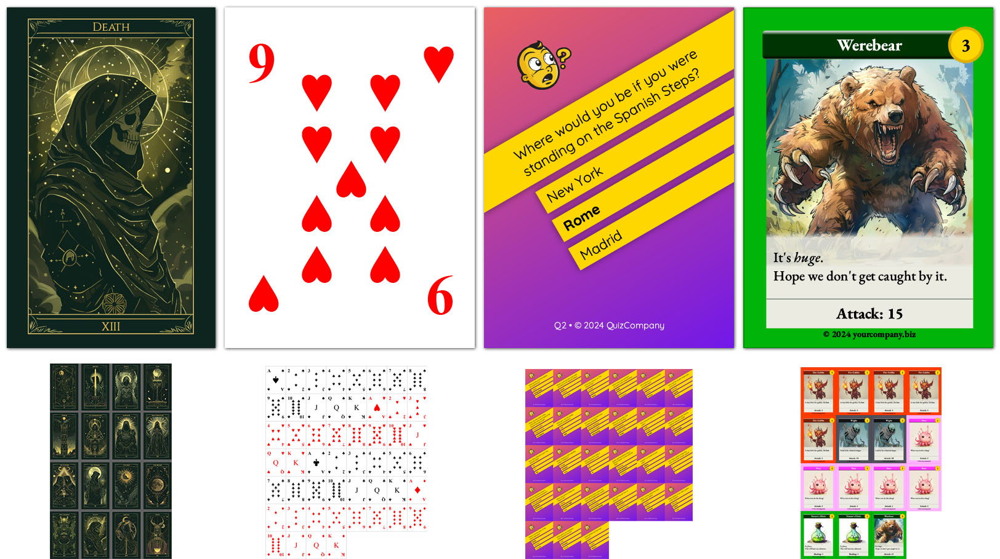
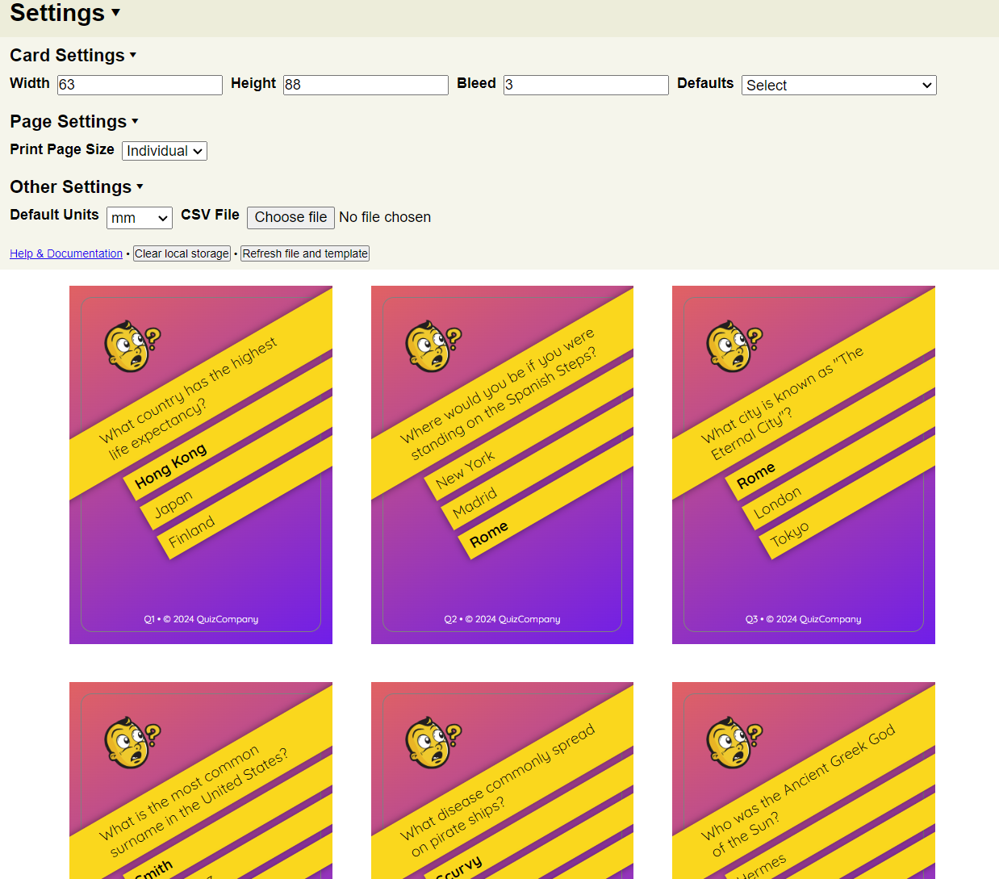

# Jubbly

HTML + CSS Card Creator


Easily create data driven playing cards in browser, for digital or print use.

Generates cards based on a csv file in HTML and CSS.



All of these examples were quickly laid out in less than a day (for all 4). These are actual decks with a number of cards (15 for tarot, 52 for classic, 27 for quiz and 15 for the fantasy cards).

## Features

* ✅ Any card size
* ✅ Built in support for bleed (any size)
* ✅ Print on any page size, with centering, at home or professionally
* ✅ Print/export cards individually
* ✅ Limited only by HTML and CSS
* ✅ Vector output for most elements / text
* ✅ High resolution raster output elsewhere
* ❌ Does not support CMYK colours natively (but I have some tips for getting around this)

## Uses

* ✅ Custom Playing Cards
* ✅ Trading Card Game
* ✅ Board Game Cards
* ✅ Board Game Pieces

## Requirements

You must have ```node``` and ```npm``` installed.

You must have access to a modern web browser.

If you're using this for printing, Chrome is **strongly** preferred, as it seems to have the best PDF engine.

## Installation

1. Clone this repository
2. Open a terminal and run ```npm install```
3. The install script will create ```card.html```, ```sass/card.scss``` and run ```webpack``` for you.

## Running

### npx http-server

1. run ```npm run jubbly```
2. Browser should automatically open, or navigate to [http://127.0.0.1:8081/](http://127.0.0.1:8081/) (by default)

### Server

1. run ```npm run watch```
2. navigate to repo base directory in your browser

### Serverless

1. run ```npm run watch```
2. open ```index.html``` in your text editor and manually replace the section ```<!-- the contents here are replaced with card.html -->``` with the contents of card.html

In each case, you should see the settings pop up.



## Impetus

HTML and CSS are *really powerful* when it comes to data driven layouts.

Having tried many softwares out there, nothing comes close to the customisability and felxibility afforded by good old HTML and CSS.

If you have any web dev experience, then you should find this easy - but even to someone with little experience, this should prove a flexible and easy way of creating cards.

### Other things I've tried

#### ❌ Adobe Photoshop, Illustrator, Photopea, etc

No support for data merging.

#### ❌ InDesign

Adobe InDesign is *very* capable software, and even includes data merging capability. However, if you want to do something as simple as change the background colour of a card based on a field - that's it, game over.

Ditto for needing to bold certain words in text, or conditionally display elements.

#### ❌ [Card Creatr Studio](https://cardcreatr.sffc.xyz/)

Brilliant software, but the inability to import and export CSVs is a showstopper. It also uses it's own language.

#### ❌ SVG files as templates

Using SVG would be a great choice, however, until *anything* supports SVG2.0 it's not an option, especially for lack of CMYK support and text wrapping (textArea).

#### ❌ [nanDECK](https://www.nandeck.com/)

Uses it's own proprietary language, even if it is based on HTML.

#### ❌ [Dextrous](https://www.dextrous.com.au/)

Great GUI based creator in the browser, but lacks advanced features like scripting.

## Technology

This project uses Alpine.js to easily template each of the cards.

[It is highly recommended that you familiarise yourself with Alpine.js](https://alpinejs.dev/start-here).

[SCSS](https://sass-lang.com/) is also used to make style development much easier, but you can just treat it like css if you like.

Modern CSS is utilised, heavily leaning on css variables.

## Instructions

Detailed usage instructions are included - just click the included help link in the settings.

## Examples

To view the examples, you needed to be running it in a "served" mode, so you can access the files via http (due to browser CORS policy not allowing javascript access via the file protocol).

Simply change the following lines:

```
// If you're running via a local web server, you can use this to load examples.
example: null,
```

to the name of one of the example folders:

```
// If you're running via a local web server, you can use this to load examples.
example: 'fantasy',
```

### Serverless examples

If you **really** want to view an example without running in server mode, you can browse the ```examples``` directory and copy/paste the contents of the ```card.html``` files to the area in ```index.html``` where it says:

```
<!-- the contents here are replaced with card.html -->
```

then manually input the csv file via the file input 😁👍